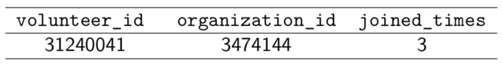

# Description

Implementation of collaborative filtering algorithm on the volunteer data.

Data includes Tsinghua and Peking University public data crawled from 

[Volunteer Beijing](www.bv2008.cn) and is preprocessed to have to the following form.




We can query [http://www.bv2008.cn/app/org/view.php?id=3474144](http://www.bv2008.cn/app/org/view.php?id=3474144) ([http://www.bv2008.cn/app/user/view.php?id=31240041](http://www.bv2008.cn/app/user/view.php?id=31240041)) at the *Volunteer Beijing* to get the person (organization) information.

Item-based collaborative filtering algorithm result: [item_based_cf_predict_result.html](http://data-visualization.leidenschaft.cn/algorithm_basic/item_based_cf_predict_result.html)

## How to
   ```shell
   python3 cf.py # generate necessary immediate files
   python3 analysis_item_based.py # generate html prediction result
   ```
    